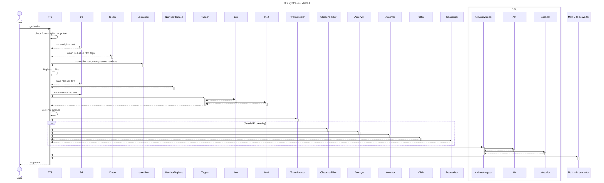

```mermaid
sequenceDiagram
    %% autonumber
    title TTS Synthesize Method

    actor User
    participant tts as TTS
    participant DB as DB
    participant Clean
    participant Normalizer
    participant num as NumberReplace
    participant Tagger
    participant Lex
    participant Morf
    participant Transliterator
    participant obscene as Obscene Filter
    participant Acronym
    participant Accenter
    participant Clitic
    participant Transcriber

    box GPU 
        participant amVoc as AMVocWrapper
        participant AM
        participant Vocoder
    end

    participant converter as Mp3 M4a converter

    User ->> tts: synthesize
    activate tts

    tts->>tts: check for empty/too large text

    tts ->>+ DB: save original text
    DB -->>- tts: 

    tts->>+Clean: clean text, drop html tags
    Clean -->>- tts: 

    tts ->>+ Normalizer: normalize text, change some numbers
    Normalizer -->>- tts: 

    tts ->> tts: Replace URLs

    tts ->>+ DB: save cleaned text
    DB -->>- tts: 

    tts ->>+ num: 
    num -->>- tts: 

    tts ->>+ DB: save normalized text
    DB -->>- tts: 

    tts ->>+ Tagger: 
    Tagger ->>+ Lex: 
    Lex -->>- Tagger: 

    Tagger ->>+ Morf: 
    Morf -->>- Tagger: 

    Tagger -->>- tts: 

    tts ->> tts: Split into batches

    tts ->>+ Transliterator: 
    Transliterator -->>- tts: 

    par Parallel Processing
        tts ->>+ obscene: 
        obscene -->>- tts: 

        tts ->>+ Acronym: 
        Acronym -->>- tts: 

        tts ->>+ Accenter: 
        Accenter -->>- tts: 

        tts ->>+ Clitic: 
        Clitic -->>- tts: 

        tts ->>+ Transcriber: 
        Transcriber -->>- tts: 
    end

    tts ->>+ amVoc: 
    amVoc ->>+ AM: 
    AM -->>- amVoc: 

    amVoc ->>+ Vocoder: 
    Vocoder -->>- amVoc: 
    amVoc -->>- tts: 

    tts ->>+ converter: 
    converter -->>- tts: 

    tts -->>- User: response
```